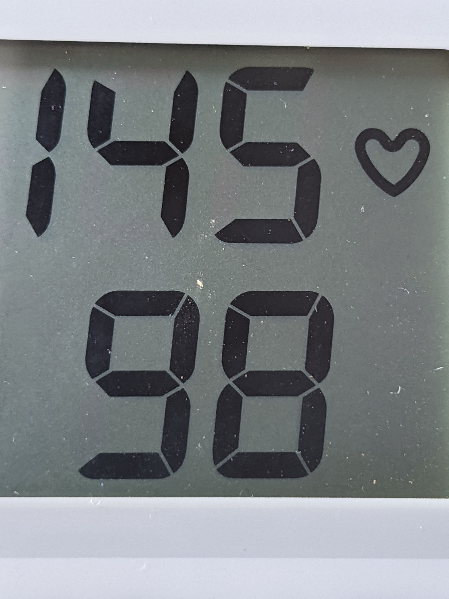

# test OCR (Minimam)

## requirement
Firebase ML(Machine Learning) Kit.

on-device (off line).

sphygmomanometer : omron HEM-737

from "Basic Activity" by Andorid Studio 4.0

## confirmed
HTC HTL23 (Android 5.0.2), Samsung Galaxy S7 edge (Andorid 7.0), ASUS_X01AD(Android 9), Pixel4 (Andorid 11)

## article
https://www.remix.asia/blog/remix/2020/10/post_35.html
